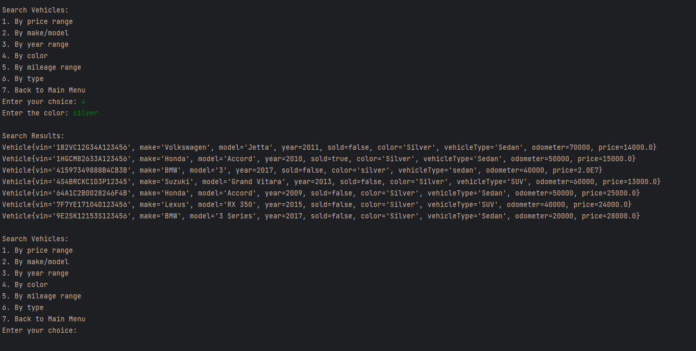
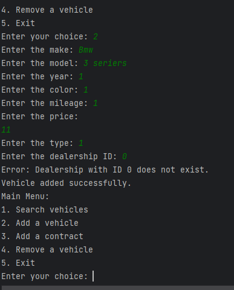
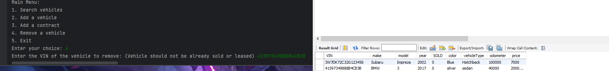
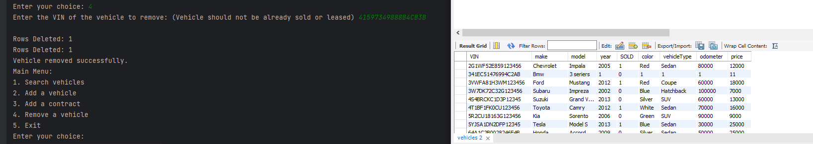

# Project Title
Jdbc-Dealership-Application
## Description of the Project
This application will be having database interaction gathering information containing a Car dealership,
Prompting user to apply the given data of the vehicle and store it into the database.

!,,,

## User Stories
- As a Developer, I want to Implement the logic to add a vehicle.
- As a Developer, I want to give the user the ability to remove a vehicle.
- As a Developer, I will need to implement Logical method and queries for VehicleDao.
- As a Developer, I want Inventory Dao: That will have two methods Add, Remove.
- As a Developer, I need to Implement View Lease Contracts Method.
- As a Developer, I need to Implement Create Lease Contract Method.

## Setup

Instructions on how to set up and run the project using IntelliJ IDEA.

### Prerequisites

- IntelliJ IDEA: Ensure you have IntelliJ IDEA installed, which you can download from [here](https://www.jetbrains.com/idea/download/).
- Java SDK: Make sure Java SDK is installed and configured in IntelliJ.

### Running the Application in IntelliJ

Follow these steps to get your application running within IntelliJ IDEA:

1. Open IntelliJ IDEA.
2. Select "Open" and navigate to the directory where you cloned or downloaded the project.
3. After the project opens, wait for IntelliJ to index the files and set up the project.
4. Find the main class with the `public static void main(String[] args)` method.
5. Right-click on the file and select 'Run 'YourMainClassName.main()'' to start the application.

## Technologies Used

- Java: 17/IntelliJ IDEA Community Edition 2022.3.2
- mySQL: MySQL Workbench 8.0 CE

## Demo

## Resources

- Notes

## Team Members

- **Devin** - Support, Encouragement

## Thanks

Express gratitude towards those who provided help, guidance, or resources:

- Thank you to [Instructor Raymond] for continuous support and guidance.
- A special thanks to all teammates for their dedication and teamwork.